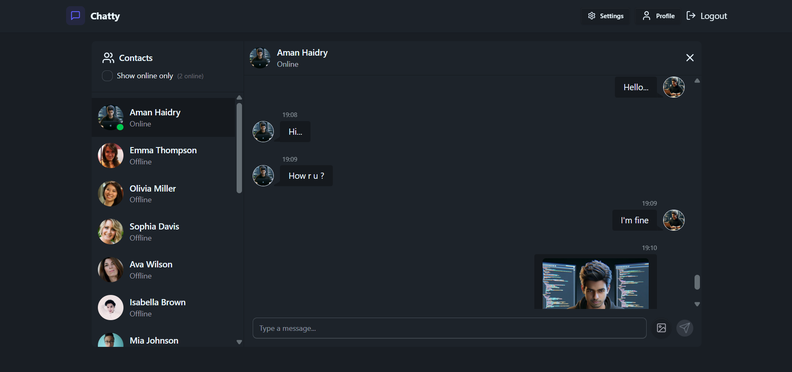
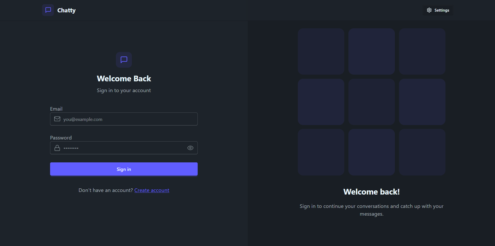
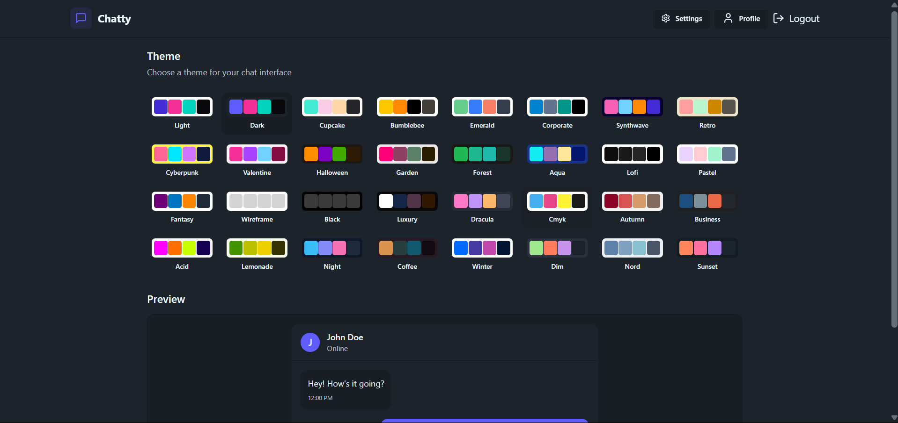

# Chatty - Real-Time Chat Application



Chatty is a full-stack real-time chat application that allows users to sign up, log in, chat with others, update their profiles, and more. It features instant messaging with Socket.IO, authentication, and a modern, responsive UI.

---

## 🚀 Features

- **User Authentication:** Sign up, log in, and log out securely with JWT-based authentication and HTTP-only cookies.
- **Real-Time Messaging:** Send and receive messages instantly using Socket.IO.
- **Profile Management:** Update your profile information and avatar.
- **Online Users:** See who is online in real time.
- **Responsive UI:** Works seamlessly on desktop and mobile devices.
- **Protected Routes:** Only authenticated users can access chat and profile pages.
- **PWA Support:** Installable as a Progressive Web App.
- **Theme Support:** Switch between 32 modern themes powered by DaisyUI, including dark, light, and many more.
- **Error Handling & Toasts:** User-friendly notifications for actions and errors.

---

## 🛠️ Tech Stack

| Layer      | Technology                | Purpose                                      |
|------------|--------------------------|----------------------------------------------|
| Frontend   | React, Vite              | UI, SPA, fast development                    |
| State      | Zustand                  | Global state management                      |
| Styling    | Tailwind CSS, DaisyUI             | Utility-first CSS framework                  |
| Routing    | React Router             | Client-side routing                          |
| Icons      | Lucide React             | Modern SVG icons                             |
| Toasts     | react-hot-toast          | Notifications                                |
| Backend    | Node.js, Express         | REST API, server logic                       |
| Auth       | JWT, bcryptjs, cookies   | Secure authentication                        |
| Database   | MongoDB, Mongoose        | Data storage and modeling                    |
| Real-Time  | Socket.IO                | Real-time messaging                          |
| File Upload| Cloudinary               | Image storage for avatars                    |
| Env Mgmt   | dotenv                   | Environment variable management              |
| Deployment | Render, Netlify          | Hosting backend and frontend                 |

---

## 📸 Screenshots

| Login Page | Chat Page | Setting Page |
|------------|-----------|--------------|
|  |  |  |

---

## 🌐 Live Demo

- **Chatty:** [Click Here](https://chat-app-chatty.netlify.app)

---

## 🖥️ Local Development Setup

### 1. **Clone the Repository**
```sh
git clone https://github.com/amanhaidry/Chat-App.git
cd chatty/Chat-App
```

### 2. **Backend Setup**

```sh
cd backend
npm install
```

#### **Create a `.env` file in `backend/` with:**
```
PORT=5001
MONGODB_URI=your_mongodb_connection_string
JWT_SECRET=your_jwt_secret
CLOUDINARY_CLOUD_NAME=your_cloudinary_cloud_name
CLOUDINARY_API_KEY=your_cloudinary_api_key
CLOUDINARY_API_SECRET=your_cloudinary_api_secret
CLIENT_URL=http://localhost:5173
```

### 3. **Frontend Setup**

```sh
cd ../frontend
npm install
```

#### **Create a `.env` file in `frontend/` with:**
```
VITE_BACKEND_URL=http://localhost:5001
```

### 4. **Run the Applications**

- **Backend:**  
  ```sh
  cd backend
  npm run dev
  ```
- **Frontend:**  
  ```sh
  cd frontend
  npm run dev
  ```

- Visit [http://localhost:5173](http://localhost:5173) in your browser.

---

## ⚙️ Environment Variables

### **Backend (`backend/.env`):**
- `PORT` - Port for backend server (default: 5001)
- `MONGODB_URI` - MongoDB connection string
- `JWT_SECRET` - Secret for JWT signing
- `CLOUDINARY_CLOUD_NAME` - Cloudinary cloud name
- `CLOUDINARY_API_KEY` - Cloudinary API key
- `CLOUDINARY_API_SECRET` - Cloudinary API secret
- `CLIENT_URL` - Frontend URL (for CORS)

### **Frontend (`frontend/.env`):**
- `VITE_BACKEND_URL` - Backend API URL

---

## 📝 Additional Notes

- **CORS:** The backend is configured to allow multiple frontend URLs for development and production.
- **PWA:** The frontend is installable as a Progressive Web App.
- **Socket.IO:** Real-time features require both frontend and backend to be running.
- **Production:** Use Render for backend and Netlify for frontend. Set environment variables in their respective dashboards.


---

